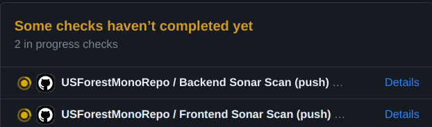

# FOREST SERVICE INVENTORY QUERY BUILDER

An app to access the public data from the US Forest Service available available openly at [Google Cloud](https://console.cloud.google.com/marketplace/product/us-forest-service/forest-inventory-analysis)

 

## PROJECT PLANNING

A Backlog was defined through the usage of **Github Projects**. Right now its public and viewable by everyone:

- [Github Project: Project Direction](https://github.com/users/Felipe-RA/projects/2)

---

## CI/CD Compatibility!

This project is compatible with Github Actions + Sonacloud Analysis, and its configured as a **MONOREPO** that analyzes the `frontend` and the `backend` on two different processes!

